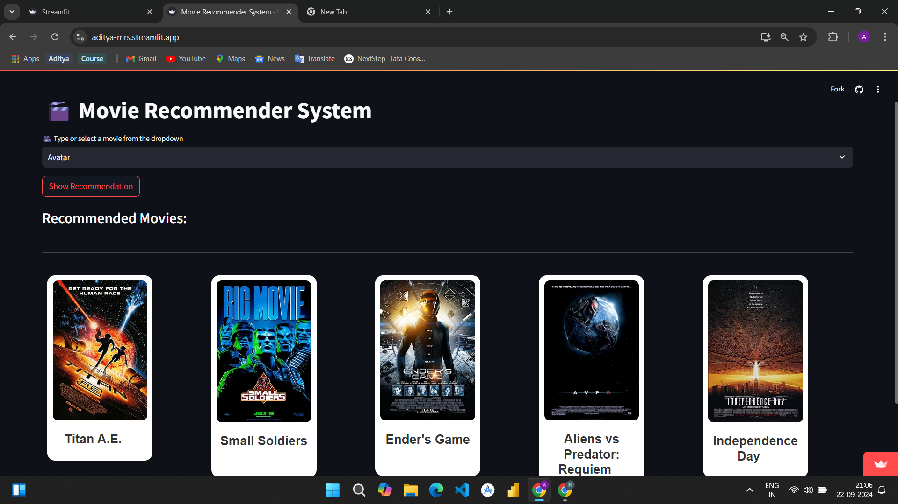

# Movie Recommendation System 🎬
## 🌐 Demo
Check out the live version of the project here: [Movie Recommendation System](https://aditya-mrs.streamlit.app/)

This repository contains a **Movie Recommendation System** that suggests movies based on user preferences and behavior. The recommendation system leverages machine learning techniques and a collaborative filtering approach to provide personalized movie recommendations.

## 📋 Features
- **Personalized Recommendations**: Get movie suggestions based on your viewing history and ratings.
- **Collaborative Filtering**: Uses both user-based and item-based filtering methods for enhanced recommendations.
- **Content-Based Filtering**: Recommends movies based on genre, actors, directors, and other metadata.
- **Hybrid Approach**: Combines multiple filtering techniques to improve recommendation accuracy.
- **Interactive UI**: A user-friendly interface for rating movies and viewing recommendations.
- **Scalable**: Optimized for performance, handling a large dataset of movies and users.

